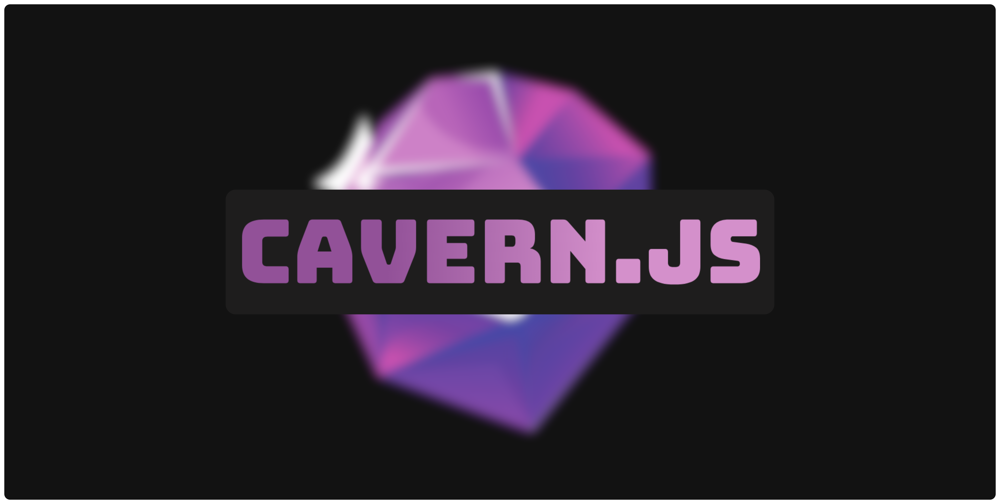

	 
	

		
	

<h1 align="center">Cavern.JS</h1>

Cavern.JS is an open-source, lightweight, and easy-to-use TypeScript/JavaScript library for interacting with the KastelApp API, an alternative to other major chat platforms. One of the first KastelApp API libraries.

- [Discord]
- [Kastel Server]
- [Documentation]

[Discord]: https://discord.gg/UZAqsNTZWB
[Kastel Server]: https://development.kastelapp.com/invite/sCJuuGsmklppaf9
[Documentation]: https://cavern.js.org/